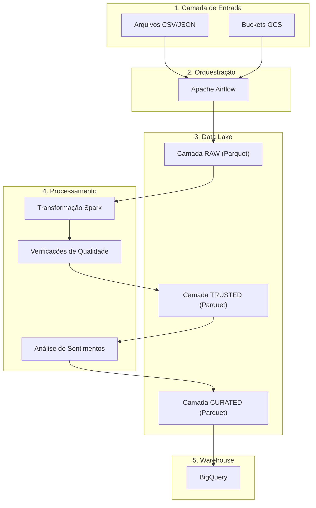

# Visão Geral da Arquitetura

## Arquitetura de Alto Nível

```
┌─────────────────────────────────────────────────────────────────────┐
│                      FONTES DE DADOS                                 │
│  - Google Reviews, TripAdvisor, Yelp, Email, Redes Sociais         │
└─────────────────────────────────────────────────────────────────────┘
                                   │
                                   ▼
┌─────────────────────────────────────────────────────────────────────┐
│                     CAMADA DE INGESTÃO                               │
│  - Ler CSV/JSON de local ou GCS                                    │
│  - Adicionar metadados (ingestion_timestamp, source)               │
│  - Escrever na camada RAW (Parquet)                                │
└─────────────────────────────────────────────────────────────────────┘
                                   │
                                   ▼
┌─────────────────────────────────────────────────────────────────────┐
│                   GOOGLE CLOUD STORAGE (Data Lake)                  │
│  ┌───────────────────────────────────────────────────────────────┐  │
│  │  raw/reviews/ano=AAAA/mês=MM/dia=DD/                          │  │
│  │  - Formato original de dados (Parquet)                       │  │
│  │  - Particionado por data de ingestão                         │  │
│  └───────────────────────────────────────────────────────────────┘  │
│  ┌───────────────────────────────────────────────────────────────┐  │
│  │  trusted/reviews/ano=AAAA/mês=MM/dia=DD/                     │  │
│  │  - Dados limpos e validados                                  │  │
│  │  - Fontes normalizadas, cidades, estados                     │  │
│  └───────────────────────────────────────────────────────────────┘  │
│  ┌───────────────────────────────────────────────────────────────┐  │
│  │  curated/cliente_sentimento/ano=AAAA/mês=MM/dia=DD/         │  │
│  │  - Dados finais com análise de sentimentos                   │  │
│  │  - Pronto para ingestão no BigQuery                          │  │
│  └───────────────────────────────────────────────────────────────┘  │
└─────────────────────────────────────────────────────────────────────┘
                                   │
                                   ▼
┌─────────────────────────────────────────────────────────────────────┐
│                   APACHE AIRFLOW (Orquestração)                    │
│  - DAGs definem dependências de workflow                           │
│  - Retentativas de tarefas e tratamento de erros                  │
│  - Logging e monitoramento                                         │
│  - Pode rodar localmente OU conectar ao Cloud Composer            │
└─────────────────────────────────────────────────────────────────────┘
                                   │
                                   ▼
┌─────────────────────────────────────────────────────────────────────┐
│                  CAMADA DE VALIDAÇÃO DE DADOS                       │
│  - Validação de schema                                             │
│  - Verificações de nulos                                           │
│  - Validação de faixa (ratings 1-5)                               │
│  - Validação de fonte                                              │
│  - Detecção de duplicatas                                          │
│  - Métricas de qualidade de dados                                  │
└─────────────────────────────────────────────────────────────────────┘
                                   │
                                   ▼
┌─────────────────────────────────────────────────────────────────────┐
│                  APACHE SPARK / DATAPROC                            │
│  - Deduplicação (Spark)                                            │
│  - Tratamento de nulos (Spark)                                     │
│  - Normalização de texto (Spark)                                   │
│  - Padronização (fontes, cidades, estados)                        │
│  - Validação de ratings (Spark)                                    │
└─────────────────────────────────────────────────────────────────────┘
                                   │
                                   ▼
┌─────────────────────────────────────────────────────────────────────┐
│                 CAMADA DE ANÁLISE DE SENTIMENTOS                    │
│  - VADER (Valence Aware Dictionary for Sentiment Reasoning)       │
│  - Biblioteca Python local (sem API externa)                       │
│  - Saída: POSITIVO, NEUTRO, NEGATIVO                              │
│  - Saída: sentiment_score (-1.0 a +1.0)                           │
└─────────────────────────────────────────────────────────────────────┘
                                   │
                                   ▼
┌────────────────────────────────────��────────────────────────────────┐
│                     BIGQUERY (Data Warehouse)                       │
│  Dataset: customer_experience                                       │
│  ┌───────────────────────────────────────────────────────────────┐  │
│  │  dim_source                                                   │  │
│  │  - source_id (PK)                                             │  │
│  │  - source_name                                                │  │
│  └───────────────────────────────────────────────────────────────┘  │
│  ┌───────────────────────────────────────────────────────────────┐  │
│  │  dim_location                                                 │  │
│  │  - location_id (PK)                                           │  │
│  │  - cidade                                                     │  │
│  │  - estado                                                     │  │
│  │  - país                                                       │  │
│  └───────────────────────────────────────────────────────────────┘  │
│  ┌───────────────────────────────────────────────────────────────┐  │
│  │  fact_reviews (Partitioned por review_date)                  │  │
│  │  - review_id (PK)                                             │  │
│  │  - customer_id                                                │  │
│  │  - source_id (FK)                                             │  │
│  │  - location_id (FK)                                           │  │
│  │  - rating                                                     │  │
│  │  - review_text                                                │  │
│  │  - sentiment                                                  │  │
│  │  - sentiment_score                                            │  │
│  │  - review_date                                                │  │
│  │  - ingestion_timestamp                                        │  │
│  │  - processing_timestamp                                       │  │
│  │  - CLUSTERED BY source_id, location_id, sentiment            │  │
│  └───────────────────────────────────────────────────────────────┘  │
└─────────────────────────────────────────────────────────────────────┘
                                   │
                                   ▼
┌─────────────────────────────────────────────────────────────────────┐
│                   ANALÍTICOS & DASHBOARDS                           │
│  - Consultas SQL para insights de negócio                         │
│  - Dashboards Looker Studio / Superset / Metabase                │
│  - Relatórios agendados                                            │
└─────────────────────────────────────────────────────────────────────┘
```

## Diagrama de Fluxo de Dados



## Tech Stack

| Camada | Tecnologia | Propósito |
|--------|------------|-----------|
| Orquestração | Apache Airflow | Gerenciamento de workflow, agendamento, monitoramento |
| Processamento | PySpark / Dataproc | Transformação de dados em grande escala |
| Armazenamento | Google Cloud Storage | Data lake (RAW, TRUSTED, CURATED) |
| Warehouse | BigQuery | Data warehouse, analíticos |
| Sentimento | VADER (NLTK) | Classificação de sentimentos |
| Infraestrutura | Terraform | IaC para recursos GCP |
| Containerização | Docker | Ambiente de desenvolvimento local |

## Pipeline de Processamento de Dados

1. **Ingestão de Dados**
   - Ler CSV/JSON de local ou GCS
   - Adicionar metadados (ingestion_timestamp, source)
   - Escrever na camada RAW (formato Parquet)

2. **Validação de Dados**
   - Validação de schema
   - Verificações de nulos
   - Validação de faixa
   - Detecção de duplicatas
   - Métricas de qualidade de dados

3. **Transformação de Dados**
   - Deduplicação
   - Tratamento de nulos
   - Normalização de texto
   - Padronização (fontes, cidades, estados)
   - Validação de ratings

4. **Análise de Sentimentos**
   - Classificação VADER
   - Cálculo de score (-1.0 a +1.0)
   - Atribuição de rótulo (POSITIVO/NEUTRO/NEGATIVO)

5. **Carregamento de Dados**
   - Criar dimensões (dim_source, dim_location)
   - Criar tabela fato (fact_reviews)
   - Particionar por review_date
   - Clusterizar para otimização de consultas

## Tratamento de Erros

- **Retentativas**: Tarefas retentam até 3 vezes em caso de falha
- **Logging**: Todas as tarefas logam para logs do Airflow e stdout
- **Fail Fast**: Validações críticas fazem o DAG falhar imediatamente
- **Idempotência**: Todas as tarefas são idempotentes (podem ser reexecutadas com segurança)

## Escalabilidade

- **Local**: Processa 10.000 registros em ~1-2 minutos
- **GCP**: Pode escalar para milhões de registros com Dataproc
- **Streaming**: Pode ser estendido com Pub/Sub + Dataflow
