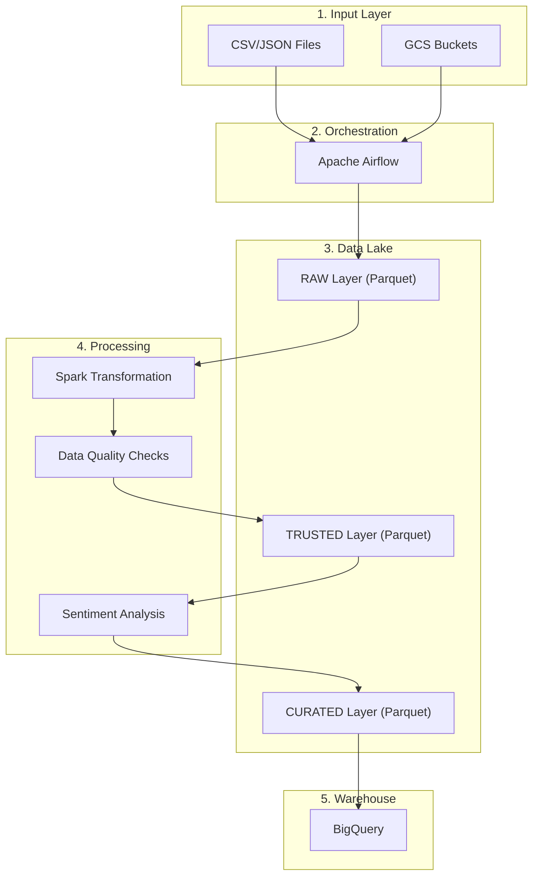

# Architecture Overview

## High-Level Architecture

```
┌─────────────────────────────────────────────────────────────────────┐
│                      DATA SOURCES                                    │
│  - Google Reviews, TripAdvisor, Yelp, Email, Social Media          │
└─────────────────────────────────────────────────────────────────────┘
                                  │
                                  ▼
┌─────────────────────────────────────────────────────────────────────┐
│                     INGESTION LAYER                                  │
│  - Read CSV/JSON from local or GCS                                 │
│  - Add metadata (ingestion_timestamp, source)                      │
│  - Write to RAW layer (Parquet)                                    │
└─────────────────────────────────────────────────────────────────────┘
                                  │
                                  ▼
┌─────────────────────────────────────────────────────────────────────┐
│                   GOOGLE CLOUD STORAGE (Data Lake)                  │
│  ┌───────────────────────────────────────────────────────────────┐  │
│  │  raw/reviews/year=YYYY/month=MM/day=DD/                      │  │
│  │  - Original data format (Parquet)                            │  │
│  │  - Partitioned by ingestion date                             │  │
│  └───────────────────────────────────────────────────────────────┘  │
│  ┌───────────────────────────────────────────────────────────────┐  │
│  │  trusted/reviews/year=YYYY/month=MM/day=DD/                  │  │
│  │  - Cleaned and validated data                                │  │
│  │  - Normalized sources, cities, states                        │  │
│  └───────────────────────────────────────────────────────────────┘  │
│  ┌───────────────────────────────────────────────────────────────┐  │
│  │  curated/customer_sentiment/year=YYYY/month=MM/day=DD/      │  │
│  │  - Final data with sentiment analysis                        │  │
│  │  - Ready for BigQuery ingestion                              │  │
│  └───────────────────────────────────────────────────────────────┘  │
└─────────────────────────────────────────────────────────────────────┘
                                  │
                                  ▼
┌─────────────────────────────────────────────────────────────────────┐
│                    APACHE AIRFLOW (Orchestration)                   │
│  - DAGs define workflow dependencies                               │
│  - Task retries and error handling                                 │
│  - Logging and monitoring                                          │
│  - Can run locally OR connect to Cloud Composer                   │
└─────────────────────────────────────────────────────────────────────┘
                                  │
                                  ▼
┌─────────────────────────────────────────────────────────────────────┐
│                    DATA VALIDATION LAYER                            │
│  - Schema validation                                               │
│  - Null checks                                                     │
│  - Range validation (ratings 1-5)                                 │
│  - Source validation                                               │
│  - Duplicate detection                                             │
│  - Data quality metrics                                            │
└─────────────────────────────────────────────────────────────────────┘
                                  │
                                  ▼
┌─────────────────────────────────────────────────────────────────────┐
│                  APACHE SPARK / DATAPROC                            │
│  - Deduplication (Spark)                                           │
│  - Null handling (Spark)                                           │
│  - Text normalization (Spark)                                      │
│  - Standardization (Spark)                                         │
│  - Rating validation (Spark)                                       │
└─────────────────────────────────────────────────────────────────────┘
                                  │
                                  ▼
┌─────────────────────────────────────────────────────────────────────┐
│                   SENTIMENT ANALYSIS LAYER                          │
│  - VADER (Valence Aware Dictionary for Sentiment Reasoning)       │
│  - Local Python library (no external API)                          │
│  - Output: POSITIVE, NEUTRAL, NEGATIVE                            │
│  - Output: sentiment_score (-1.0 to +1.0)                         │
└─────────────────────────────────────────────────────────────────────┘
                                  │
                                  ▼
┌─────────────────────────────────────────────────────────────────────┐
│                       BIGQUERY (Data Warehouse)                     │
│  Dataset: customer_experience                                       │
│  ┌───────────────────────────────────────────────────────────────┐  │
│  │  dim_source                                                   │  │
│  │  - source_id (PK)                                             │  │
│  │  - source_name                                                │  │
│  └───────────────────────────────────────────────────────────────┘  │
│  ┌───────────────────────────────────────────────────────────────┐  │
│  │  dim_location                                                 │  │
│  │  - location_id (PK)                                           │  │
│  │  - city                                                       │  │
│  │  - state                                                      │  │
│  │  - country                                                    │  │
│  └───────────────────────────────────────────────────────────────┘  │
│  ┌───────────────────────────────────────────────────────────────┐  │
│  │  fact_reviews (Partitioned by review_date)                   │  │
│  │  - review_id (PK)                                             │  │
│  │  - customer_id                                                │  │
│  │  - source_id (FK)                                             │  │
│  │  - location_id (FK)                                           │  │
│  │  - rating                                                     │  │
│  │  - review_text                                                │  │
│  │  - sentiment                                                  │  │
│  │  - sentiment_score                                            │  │
│  │  - review_date                                                │  │
│  │  - ingestion_timestamp                                        │  │
│  │  - processing_timestamp                                       │  │
│  │  - CLUSTER BY source_id, location_id, sentiment              │  │
│  └───────────────────────────────────────────────────────────────┘  │
└─────────────────────────────────────────────────────────────────────┘
                                  │
                                  ▼
┌─────────────────────────────────────────────────────────────────────┐
│                      ANALYTICS & DASHBOARDS                         │
│  - SQL queries for business insights                               │
│  - Looker Studio / Superset / Metabase dashboards                 │
│  - Scheduled reports                                               │
└─────────────────────────────────────────────────────────────────────┘
```

## Data Flow Diagram



## Technology Stack

| Layer | Technology | Purpose |
|-------|-----------|---------|
| Orchestration | Apache Airflow | Workflow management, scheduling, monitoring |
| Processing | PySpark / Dataproc | Large-scale data transformation |
| Storage | Google Cloud Storage | Data lake (RAW, TRUSTED, CURATED) |
| Warehouse | BigQuery | Data warehouse, analytics |
| Sentiment | VADER (NLTK) | Sentiment classification |
| Infrastructure | Terraform | IaC for GCP resources |
| Containerization | Docker | Local development environment |

## Data Processing Pipeline

1. **Data Ingestion**
   - Read CSV/JSON from local or GCS
   - Add metadata (ingestion_timestamp, source)
   - Write to RAW layer (Parquet format)

2. **Data Validation**
   - Schema validation
   - Null checks
   - Range validation
   - Duplicate detection
   - Data quality metrics

3. **Data Transformation**
   - Deduplication
   - Null handling
   - Text normalization
   - Standardization (sources, cities, states)
   - Rating validation

4. **Sentiment Analysis**
   - VADER classification
   - Score calculation (-1.0 to +1.0)
   - Label assignment (POSITIVE/NEUTRAL/NEGATIVE)

5. **Data Loading**
   - Create dimensions (dim_source, dim_location)
   - Create fact table (fact_reviews)
   - Partition by review_date
   - Cluster for query optimization

## Error Handling

- **Retries**: Tasks retry up to 3 times on failure
- **Logging**: All tasks log to Airflow logs and stdout
- **Fail Fast**: Critical validations cause DAG to fail immediately
- **Idempotency**: All tasks are idempotent (can be re-run safely)

## Scalability

- **Local**: Processes 10,000 records in ~1-2 minutes
- **GCP**: Can scale to millions of records with Dataproc
- **Streaming**: Can be extended with Pub/Sub + Dataflow
