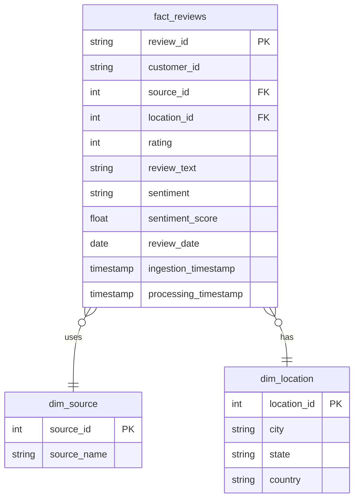

# Data Model

## BigQuery Schema

### Dataset: `customer_experience`

## Dimension Tables

### dim_source

Stores supported review sources.

| Column | Type | Description |
|--------|------|-------------|
| source_id | INT64 | Unique source identifier (PK) |
| source_name | STRING | Source name (google_reviews, tripadvisor, yelp, email, social_media) |

**Example Data:**
| source_id | source_name |
|-----------|-------------|
| 1 | google_reviews |
| 2 | tripadvisor |
| 3 | yelp |
| 4 | email |
| 5 | social_media |

### dim_location

Stores location information.

| Column | Type | Description |
|--------|------|-------------|
| location_id | INT64 | Unique location identifier (PK) |
| city | STRING | City name |
| state | STRING | State abbreviation (e.g., SP, RJ, MG) |
| country | STRING | Country code (e.g., BR) |

**Example Data:**
| location_id | city | state | country |
|-------------|------|-------|---------|
| 1 | São Paulo | SP | BR |
| 2 | Rio de Janeiro | RJ | BR |
| 3 | Belo Horizonte | MG | BR |
| 4 | Salvador | BA | BR |

## Fact Table

### fact_reviews

Main table containing customer reviews with sentiment analysis.

| Column | Type | Description |
|--------|------|-------------|
| review_id | STRING | Unique review identifier (PK) |
| customer_id | STRING | Customer identifier |
| source_id | INT64 | Foreign key to dim_source |
| location_id | INT64 | Foreign key to dim_location |
| rating | INT64 | Rating (1-5) |
| review_text | STRING | Cleaned review text |
| sentiment | STRING | Sentiment classification |
| sentiment_score | FLOAT64 | Sentiment score (-1.0 to +1.0) |
| review_date | DATE | Date of the review |
| ingestion_timestamp | TIMESTAMP | When record was ingested |
| processing_timestamp | TIMESTAMP | When record was processed |

**Partitioning:** `review_date` (Daily)

**Clustering:** `source_id`, `location_id`, `sentiment`

### Partition Strategy

Daily partitioning on `review_date` is optimal because:
- Queries typically filter by date range
- Enables efficient deletion of old data
- Supports time-based analytics

### Clustering Strategy

Clustering on `source_id`, `location_id`, and `sentiment` optimizes:
- Filter by source (most common query)
- Filter by location
- Filter by sentiment (for sentiment analysis)

**Note:** Clustering is optional and depends on query patterns.

## Data Relationships



## ETL Flow

```
Input Data → Clean → Validate → Transform → Join Dimensions → Load to BigQuery
```

### Step-by-Step

1. **Input**: Raw reviews CSV
2. **Clean**: Remove duplicates, handle nulls, normalize text
3. **Validate**: Check ratings (1-5), valid sources, non-empty text
4. **Transform**: Create sentiment, add processing timestamps
5. **Dimension Lookup**: Get source_id and location_id from dimension tables
6. **Load**: Insert into fact_reviews

## Analytics Queries

See `sql/analytics.sql` for examples:

1. **Count reviews by source**
2. **Sentiment by city**
3. **Overall sentiment distribution**
4. **Average rating by source**
5. **Rating distribution**
6. **Sentiment over time (daily)**
7. **Cities with most negative sentiment**
8. **Correlation between rating and sentiment**
9. **Monthly trend**
10. **Review count by location**

## Quality Metrics

| Metric | Description | Threshold |
|--------|-------------|-----------|
| total_records | Total records processed | N/A |
| valid_records | Records passing all validations | > 95% of total |
| invalid_ratings | Records with invalid ratings | < 1% of total |
| duplicate_records | Duplicate review_ids | 0 |
| null_text | Records with empty text | < 1% of total |
| sentiment_distribution | Positive/Neutral/Negative ratio | Business defined |

See `sql/data_quality.sql` for validation queries.
